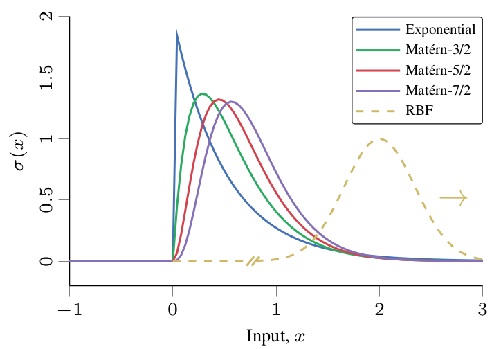
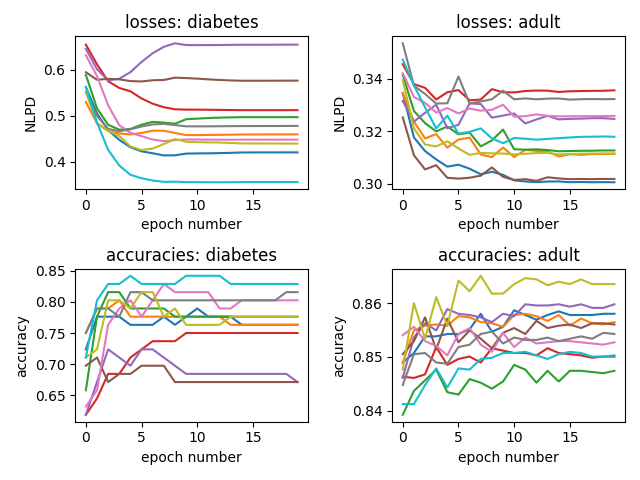
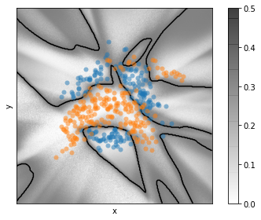

# Stationary Activations for Uncertainty Calibration in Deep Learning

This repository is the official implementation of the methods in the publication
* L. Meronen, C. Irwanto, and A. Solin (2020). **Stationary Activations for Uncertainty Calibration in Deep Learning**. *Advances in Neural Information Processing Systems (NeurIPS)*. [[arXiv]](https://arxiv.org/abs/2010.09494)

The main result of the paper is deriving Matérn activation functions that allow neural networks to mimic the properties of the Matérn family of kernels in Gaussian process models. This improves uncertainty estimates for neural networks especially for out-of-distribution samples. Matérn activation functions with different smoothness parameter values are plotted below:



If you use the code in this repository for your research, please cite the paper as follows:
```
@inproceedings{meronen2020,
  title={Stationary Activations for Uncertainty Calibration in Deep Learning},
  author={Meronen, Lassi and Irwanto, Christabella and Solin, Arno},
  booktitle = {Accepted for publication in Advances in Neural Information Processing Systems (NeurIPS)},
  year={2020}
}
```

## Requirements

Installing dependencies (recommended Python version 3.7.3 and pip version 20.1.1):
```setup
pip install -r requirements.txt
```

Alternatively, using a conda environment:
```setup
conda create -n stationary_activations python=3.7.3 pip=20.1.1
conda activate stationary_activations
pip install -r requirements.txt
```

## 10-fold cross-validation on UCI benchmark classification datasets

To train and evaluate a 10-fold cross-validation test of a neural network with a Matérn-3/2 activation function on two UCI classification benchmarks data sets (diabetes and adult), run this command:

```train
python src/UCI_benchmark_classification.py
```
Note that running this script on CPU takes around 20 minutes.

Expected printed result:
```
Dataset name:  diabetes
number of samples:  768
number of features:  8
mean NLPD:  0.492
std of NLPD:  0.078
mean ACC:  0.762
std of ACC:  0.051

Dataset name:  adult
number of samples:  45222
number of features:  14
mean NLPD:  0.317
std of NLPD:  0.006
mean ACC:  0.855
std of ACC:  0.005
```

This script will also produce mid training loss and accuracy plots for each fold similar to the following:




## 2D classification on Banana data set

To train and evaluate a neural network with a Matérn-5/2 activation function on a 2D classification toy example on the Banana dataset, run this command to open the jupyter notebook:
```
jupyter notebook notebooks/banana_classification.ipynb
```

The model evaluation should produce the following image:



## Contributing

For all correspondence, please contact lassi.meronen@aalto.fi.

## License

This software is provided under the Apache License 2.0. See the accompanying LICENSE file for details.

